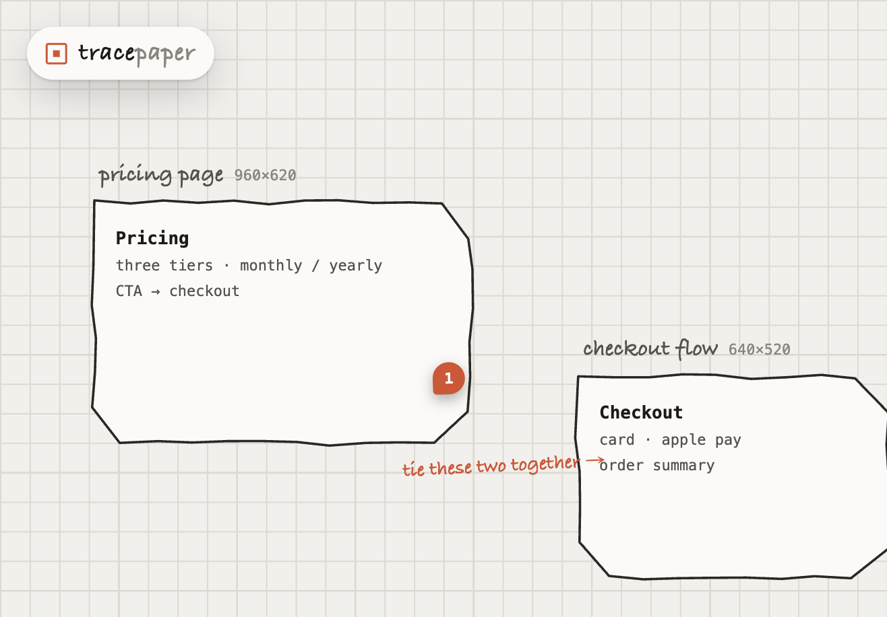
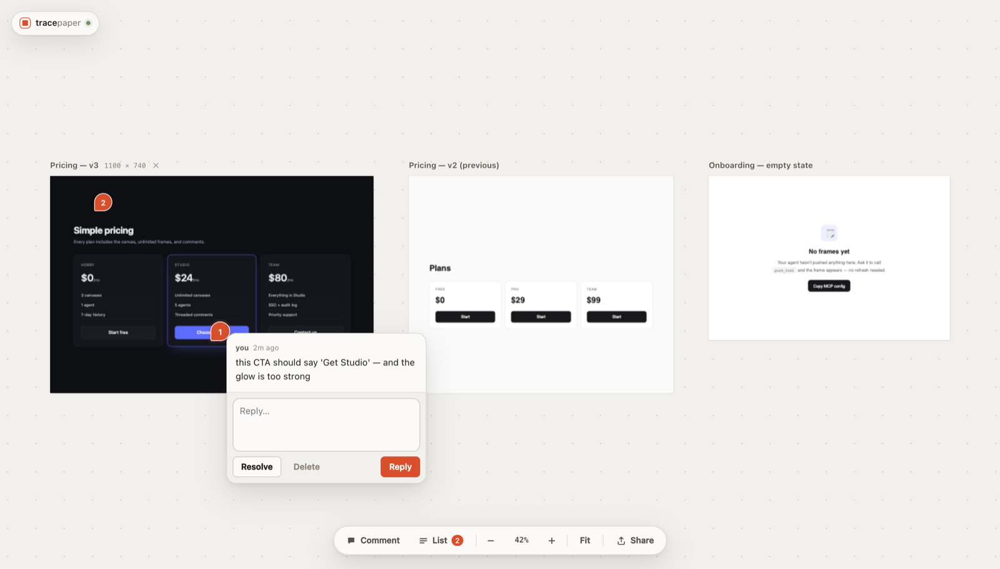

# tracepaper

[](https://github.com/caffeinum/tracepaper/actions/workflows/ci.yml)

An MCP server that gives an agent a canvas.

<p align="center">
  
</p>

The agent pushes HTML frames onto it. A human opens the canvas in a browser, scrolls
around, and drops pinned comments on the frames. The agent reads those comments back
through MCP and replies inside the thread. That round trip — **draw → comment → read
feedback** — is the whole product.

<p align="center">
  
</p>

One process serves both halves — an MCP server on stdio and the canvas web app over HTTP,
sharing one SQLite database and one event bus. You start nothing by hand: your MCP client
launches it, and the canvas comes up with it. An agent's `push_html` shows up in the human's
open browser within seconds, and a human's comment is readable by the agent on the next poll.

## Install

One line, nothing to clone and nothing to build:

```sh
claude mcp add tracepaper -- bunx github:caffeinum/tracepaper
```

or in any MCP client's JSON:

```json
{ "mcpServers": { "tracepaper": { "command": "bunx", "args": ["github:caffeinum/tracepaper"] } } }
```

That is the whole install. `bunx` resolves the GitHub repo directly — no npm package needed —
and the canvas bundle compiles itself on first boot.

Requires [Bun](https://bun.sh) 1.3+, since the server uses `bun:sqlite` and `Bun.serve`:

```sh
curl -fsSL https://bun.sh/install | bash
```

`npx -y github:caffeinum/tracepaper` also works — the `bin` is a plain Node launcher that
execs Bun, and prints an install line rather than a missing-interpreter error when Bun is
absent. But it needs Node *and* Bun to run one Bun program, so prefer `bunx`.

> **Both `bunx` and `npx` cache the fetched repo.** If you are changing tracepaper, point the
> client at your clone (`bun run /path/to/tracepaper/src/index.ts`) — otherwise your agent can
> sit on a weeks-old copy while you edit, with no sign that it is happening.

### From a clone

For hacking on it:

```sh
git clone https://github.com/caffeinum/tracepaper.git
cd tracepaper
bun install
```

No build step to remember — the canvas bundle compiles on first boot if it is missing.
(`bun run build:web` exists for up-front builds, and you need it after editing
`web/canvas.ts`.)

## Run

**One command runs everything.** There is no separate canvas server to start:

```sh
bun run src/index.ts          # MCP over stdio AND the canvas over HTTP, one process
```

That is what your MCP client launches, and it is the whole setup — the canvas comes up with
it, at <http://127.0.0.1:4321> (the resolved URL is also written to `~/.tracepaper/server.json`,
and every tool returns it as `canvasUrl`).

```sh
bun run src/index.ts serve    # optional: HTTP only, the canvas with no agent attached
```

`serve` drops the MCP half. It is a convenience for keeping a canvas open in your browser
across agent restarts, not a requirement. Running both is safe: a second process started
against the same database detects the live canvas and joins it instead of binding another
port, so agent pushes land in the tab you already have open.

| env | default | meaning |
| --- | --- | --- |
| `TRACEPAPER_PORT` | `4321` | HTTP port. If busy, the next free port is used and reported. |
| `TRACEPAPER_HOST` | `127.0.0.1` | bind address |
| `TRACEPAPER_DB` | `~/.tracepaper/tracepaper.db` | SQLite file. `:memory:` for throwaway runs. |

stdout belongs to the MCP stdio transport; every log line goes to stderr.

## CLI (no MCP)

If your agent's client can't run MCP, the same eight tools are on the command line. Every verb
writes straight to the shared database as the agent — the same thing the MCP server does — so a
frame or reply lands whether or not a canvas is open. A canvas the human already has open picks
up the change on its next reconcile (~5s), the same lag the share tunnel has.

```sh
bunx github:caffeinum/tracepaper serve &            # once: hold a canvas open for the human
bunx github:caffeinum/tracepaper push page.html --name "Pricing"   # or: … push - < page.html
bunx github:caffeinum/tracepaper list
bunx github:caffeinum/tracepaper comments --since cur_7            # read human feedback
bunx github:caffeinum/tracepaper reply cmt_… "fixed — shipped it"
bunx github:caffeinum/tracepaper resolve cmt_… --note "closed out"
```

`push` accepts a file, `-` for stdin, or `--html "<…>"`, plus `--name --width --height --x --y`
and `--frame <id>` to replace an existing frame. `comments` takes `--since <cursor> --frame <id>
--author human|agent --resolved`. Add `--json` to any verb for machine-readable output; on
failure a verb prints one clean line to stderr and exits non-zero. `tracepaper help` lists them
all. The frame is saved even with no server running — `serve` is only there so a human can watch.

> **One canvas per machine, by default.** `~/.tracepaper/tracepaper.db` and port 4321 are global, so
> two projects both wired with the config below share one canvas — project B's agent will call
> `list_frames` and get project A's frames, and `push_html` with no `frameId` will land its work
> next to them. To give a project its own, set `TRACEPAPER_DB` and `TRACEPAPER_PORT` in that
> project's MCP config.

## MCP client config

The one-liner above works in every MCP client — Claude Code, Cursor, Windsurf, Zed, Claude
Desktop — via `.mcp.json`, `~/.cursor/mcp.json` or `claude_desktop_config.json`:

```json
{ "mcpServers": { "tracepaper": { "command": "bunx", "args": ["github:caffeinum/tracepaper"] } } }
```

Running from a clone instead? Point at the entry file, with an absolute path — the client
sets its own working directory:

```json
{
  "mcpServers": {
    "tracepaper": {
      "command": "bun",
      "args": ["run", "/absolute/path/to/tracepaper/src/index.ts"],
      "env": {
        "TRACEPAPER_PORT": "4321"
      }
    }
  }
}
```

Verify it end to end without restarting your agent, using the
[`mcpt` CLI](https://github.com/f/mcptools) (`brew install f/mcptools/mcp`):

```sh
mcpt tools bun run src/index.ts
mcpt call push_html --params '{"html":"<h1>hello</h1>","name":"Smoke test"}' bun run src/index.ts
```

The second prints a `canvasUrl` — open it and the frame is there. That frame is real and stays
on your canvas: delete it from the pin menu, or
`mcpt call delete_frame --params '{"frameId":"frm_…"}' bun run src/index.ts`.

## Sharing

Click **Share** in the toolbar. tracepaper runs [`cloudflared`](https://developers.cloudflare.com/cloudflare-one/connections/connect-networks/downloads/)
for you and hands back a public URL anyone can open — no account, no config, no DNS:

```
https://trustee-borough-contemporary-molecular.trycloudflare.com
```

While a share is live it becomes the canvas's address: every tool returns it as `canvasUrl`,
so the agent hands out a link that works for someone who is not at your machine. Stop sharing
and it reverts to localhost. Requires `cloudflared` on PATH (`brew install cloudflared`); the
panel says so if it is missing.

**Linking to one frame.** Select a frame and the address bar becomes
`…/#frame=frm_abc123`. Send that and it opens zoomed to that frame. It is a **view hint, not a
permission boundary** — the whole canvas is still there to scroll to, and anyone with the link
sees all of it either way.

Read the warnings in the panel — they are real:

- **anyone with the link can view every frame and post comments.** There is no sign-in, and a
  comment is read by your agent as feedback. Only share where you would share a screen.
- **the link dies with the server**, and each share mints a new one. It is not a stable address.
- **updates reach visitors within a few seconds, not instantly** — a quick tunnel does not carry
  the SSE stream, so the canvas falls back to its periodic refetch. Measured: 0–5s.

## Tools

| tool | what it does |
| --- | --- |
| `push_html` | `{html, name?, frameId?, width?, height?, x?, y?}` — draws a frame. No `frameId` creates one, auto-placed beside the last and wrapping onto a new row so the canvas stays readable; pass `x`/`y` (world px) to place it yourself and group related work; with `frameId` it replaces that frame's HTML in place and bumps `version`, resizing it too if you pass `width`/`height`. An unknown `frameId` is an error, never a silent create. Returns `{frameId, name, version, url, canvasUrl}`. |
| `get_comments` | `{frameId?, since?, includeResolved?, author?}` — reads the human's feedback oldest-first, resolved excluded by default. Returns `{comments, cursor, frames}`; pass `cursor` back as `since` to poll for only what is new. Poll with `author: "human"` or your own replies come back looking like fresh feedback. `since` accepts an ISO timestamp too, but that matches only comments *created* after it — one the human edited or re-opened never comes back, and two written in the same millisecond cannot be separated. Prefer the cursor. |
| `get_frame` | `{frameId}` → the frame's current HTML, name, size and version. Call it before `push_html` on a frame you did not author this session: `push_html` replaces the whole document, so pushing blind discards whatever is there. |
| `list_frames` | `{}` → every frame with size, position, version, `commentCount`, `unresolvedCount` (no HTML), plus `canvasUrl`. |
| `reply_to_comment` | `{commentId, text}` — posts a threaded reply as `"agent"`; it appears live in the human's open thread. |
| `resolve_comment` | `{commentId, note?}` — closes the thread so it drops out of `get_comments`; `note` is also posted as an agent reply. Replies are resolved with their root, so your own note does not come back as fresh feedback on the next poll. |
| `tidy_canvas` | `{}` — re-packs every frame into clean rows, largest first, so nothing overlaps. Moves frames only; html, comments and pins are untouched. |
| `delete_frame` | `{frameId}` — removes a frame and its comments. |

## The loop

```
agent                                     human
-----                                     -----
push_html { html: "<h1>Pricing</h1>…" }
  → { frameId: "frm_a1b2c3d4e5f6",
      canvasUrl: "http://127.0.0.1:4321/" }
"open the canvas and tell me what's off"
                                          opens canvasUrl, presses `c`,
                                          clicks the frame, types
                                          "the CTA is buried"

get_comments { frameId: "frm_a1b2c3d4e5f6" }
  → { comments: [{ id: "cmt_9f8e…",
                   x: 612, y: 340,
                   text: "the CTA is buried",
                   author: "human" }],
      cursor: "cur_7" }

reply_to_comment { commentId: "cmt_9f8e…",
                   text: "moving it above the fold" }
                                          sees the reply in the thread

push_html { frameId: "frm_a1b2c3d4e5f6",
            html: "<h1>Pricing</h1>…" }   the iframe reloads in place,
  → { version: 2 }                        pan/zoom and pins survive

resolve_comment { commentId: "cmt_9f8e…",
                  note: "CTA is now first" }
                                          the pin greys out

get_comments { since: "cur_7" }           ← poll with the cursor for what's new
```

Comments are anchored to the frame, not to the DOM, so they survive every `push_html`
update. Each comment records the `frameVersion` it was left on.

## Canvas

- Two-finger scroll pans, `⌘`/`ctrl` + scroll zooms around the cursor, space-drag or
  middle-drag pans, `⌘0` resets, `⌘1` zooms to fit.
- `c` (or the toolbar button) arms comment mode: the next click on a frame drops a pin
  at that frame-local coordinate and opens a composer. `esc` cancels.
- Click a frame to select it (its label and outline pick up the accent). `f` or `⌘0` fits the
  selection to the viewport; `⌘1` fits everything.
- Drag a frame's **title** to move it. The title is the handle, so dragging never fights with
  clicking into the page itself. The move is written once on release.
- Click a pin to open its thread — reply, resolve, or delete there.
- Frames land in rows, wrapping about three wide, rather than marching off to the right forever.
  Placement checks every existing frame, so a new frame never lands on one — including after a
  resize or an explicit `x`/`y`. `tidy_canvas` re-packs a canvas that is already tangled.
- Sound inside a frame works once you interact with it. Autoplay on load is blocked by the
  browser's policy for sandboxed frames, which is the behaviour you want — a canvas full of
  frames cannot start making noise on its own.
- Double-click a frame to interact with the page inside it; entering also fits it to the
  viewport, since that is what you want when you step in to use it. `esc` leaves — including
  while your cursor is in a field inside the frame, which needs a small script served with each
  frame, because a cross-origin sandbox otherwise swallows the keypress. Clicking the canvas or
  the pill under the frame also leaves.
- Chrome floats over a full-bleed canvas; nothing holds a permanent column. `t` (or the
  toolbar's **List**) opens the comment list on the right, grouped by frame with unresolved
  first — clicking an entry pans to its pin. It stays closed until you ask for it; the badge
  on the toolbar button is what tells you feedback is waiting.
- Frames render in `<iframe sandbox="allow-scripts allow-forms allow-popups">` with no
  `allow-same-origin`, so pushed HTML cannot reach the canvas app or its storage.
- SSE keeps it live: pushes, comments, replies, and resolutions all arrive without a
  reload.

## HTTP API

| method | path | purpose |
| --- | --- | --- |
| GET | `/` | canvas app |
| GET | `/api/frames` | `{frames}` — frame list, no HTML |
| GET | `/api/frames/:id` | frame incl. HTML |
| POST | `/api/frames` | create (201) / update in place (200) — same body as `push_html` |
| DELETE | `/api/frames/:id` | `{ok, id}` |
| GET | `/f/:id` | raw frame HTML for the iframe `src` |
| GET | `/api/comments?frameId=&since=&includeResolved=&author=` | `{comments, cursor}` |
| POST | `/api/comments` | `{frameId, x, y, text, parentId?, author?}` → 201 |
| PATCH | `/api/comments/:id` | `{resolved?, text?}` |
| DELETE | `/api/comments/:id` | `{ok, id}` |
| GET | `/api/events` | SSE: `frame.created` `frame.updated` `frame.deleted` `comment.created` `comment.updated` `comment.deleted` |
| GET | `/api/health` | `{ok: true, frames, comments}` |

Errors are `{error: string}` with a real status code. Bad input fails with the zod
message — never a coerced default.

## Make sure it works

Two commands. The first is the whole suite; the second proves the same loop against a
client that is not our code at all.

```sh
bun run typecheck      # tsc --noEmit, strict
bun run build:web      # web/dist/canvas.js — the server refuses to boot without it
bun test               # store units + HTTP/SSE integration + MCP e2e over a real client
bash test/mcpt-loop.sh # the same loop driven by the external `mcpt` CLI
```

Expect `bun test` to report **90 pass / 0 fail across 3 files** in ~15s, and the script to
end with `OK — the loop works through mcpt`. Both exit non-zero on any failure, and both
are safe to run repeatedly: every test gets its own temp database, its own `HOME` (so your
real `~/.tracepaper/server.json` is never touched), and an ephemeral port. Nothing needs
cleaning up between runs.

### `bun test`

| file | what it covers |
| --- | --- |
| `test/store.test.ts` | ids, cascades, cursor durability (a cursor must survive resolving, editing, re-opening and deleting what it covered), transactional writes, size caps |
| `test/http.test.ts` | every route on an ephemeral port, plus SSE (one test idles 12s on purpose, to prove a stream outlives Bun's 10s default `idleTimeout`) |
| `test/mcp-e2e.test.ts` | the MCP surface, from outside |

`test/mcp-e2e.test.ts` never calls a handler directly. Each test spawns
`bun src/index.ts` as a child process against a fresh temp-file database, connects the
SDK's `Client` over `StdioClientTransport`, and drives the real loop: all six tools are
advertised → `get_frame` reads a frame's HTML back before an update replaces it → `push_html` creates a frame whose `canvasUrl` and `/f/:id` are both live →
pushing the same `frameId` bumps the version without adding a frame → a bogus `frameId`
is a tool error that creates nothing → a comment POSTed over HTTP the way the browser
does comes back through `get_comments` → the returned cursor yields only what is new →
`reply_to_comment` lands in the thread → `resolve_comment` resolves the root *and* posts
its note as an agent reply → `delete_frame` cascades. It also asserts the process
contract: the child exits on stdin EOF alone with no signal, and two server processes
can share one database file without losing writes.

### `test/mcpt-loop.sh`

Needs the [`mcpt` CLI](https://github.com/f/mcptools) on `PATH`, and exits 127 with an
install hint if it is missing (`brew install f/mcptools/mcp`). It is not part of
`bun test` for that reason — run it before you ship.

```sh
bash test/mcpt-loop.sh
```

It stands up one long-lived `serve` process on a pinned port as the human's browser side,
then has `mcpt` spawn a fresh stdio server per call against the **same** temp database
file — so the handoff it proves is a real cross-process one. Note that `mcpt` exits 0 even
when a tool returns `isError`, so the script checks `isError` itself on every call rather
than trusting the exit code.

## Releasing

Publishing to npm is tag-driven, so a release is a decision and not a side effect of a merge:

```sh
npm version patch      # bumps package.json and writes a v* tag
git push --follow-tags
```

The `release` workflow then runs the gate, builds the bundle, checks the tag matches
`package.json`, and publishes with npm [provenance](https://docs.npmjs.com/generating-provenance-statements).
It uses npm trusted publishing (OIDC) — configure this repo + the `release` workflow as a
trusted publisher on npmjs.com and no `NPM_TOKEN` secret is needed; set one as a fallback if
you would rather. `workflow_dispatch` runs the same steps as a dry-run `npm pack` without
publishing.

## License

MIT — see [LICENSE](LICENSE).
